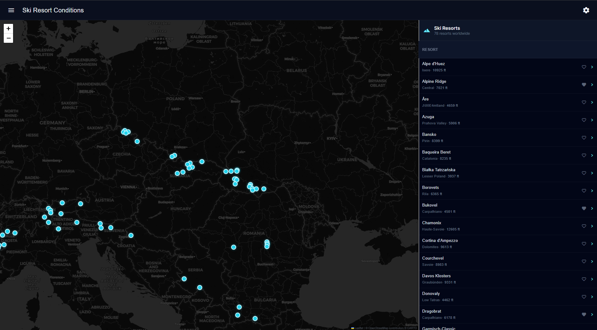
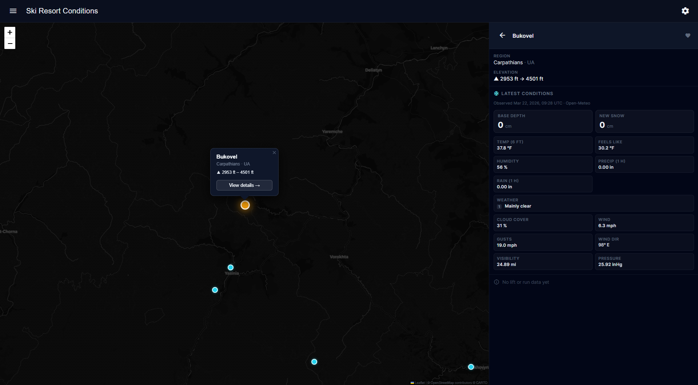
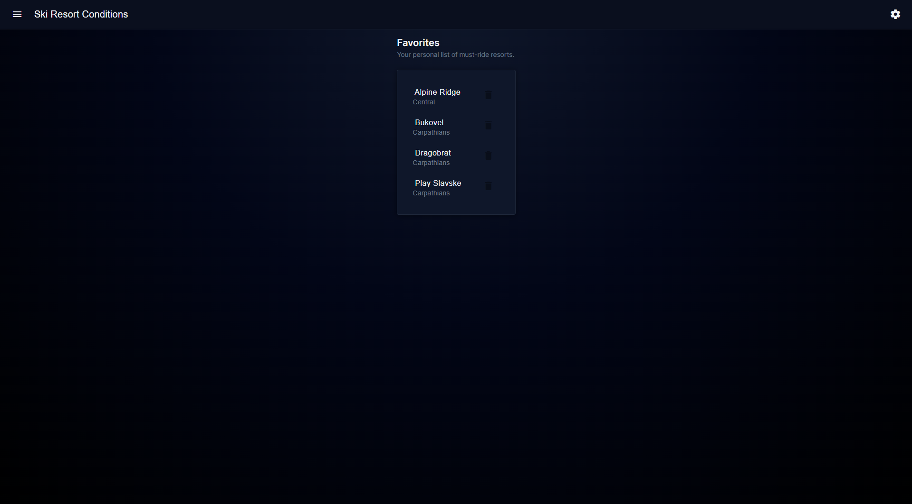
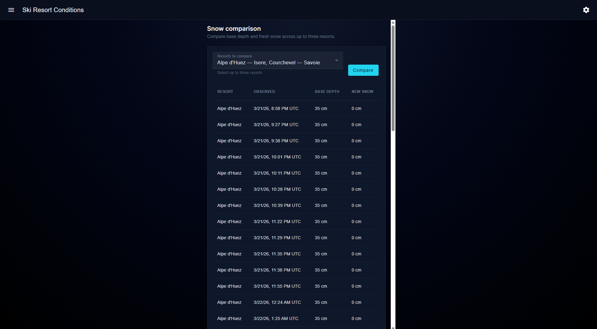
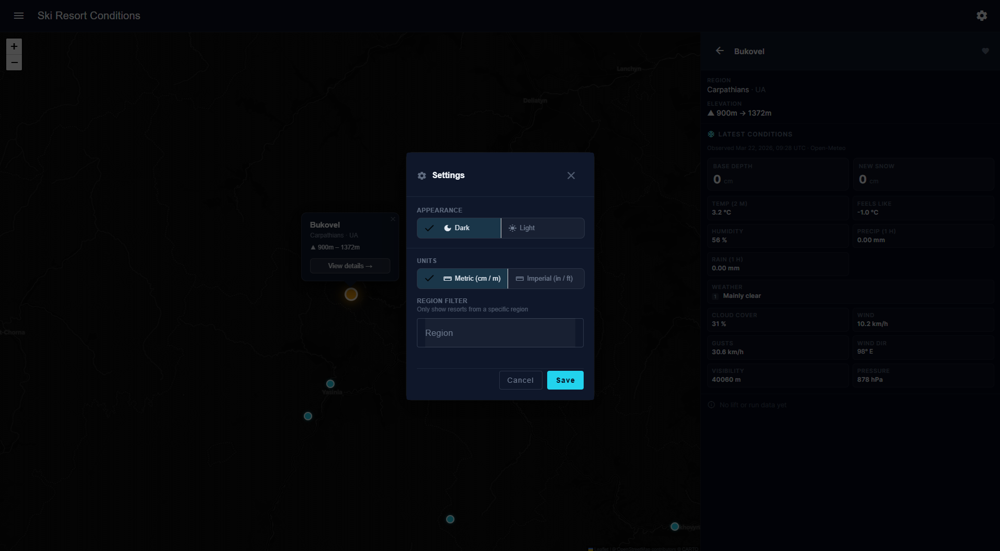
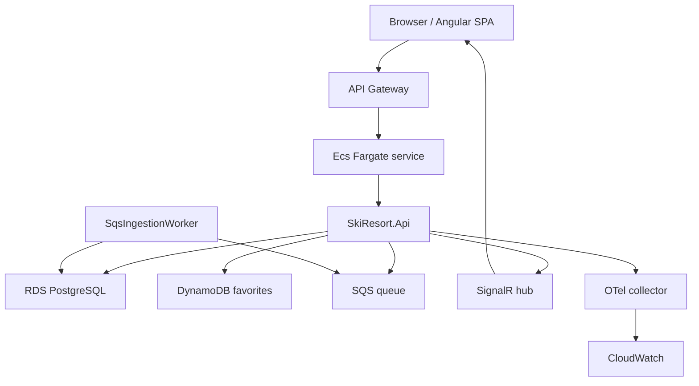
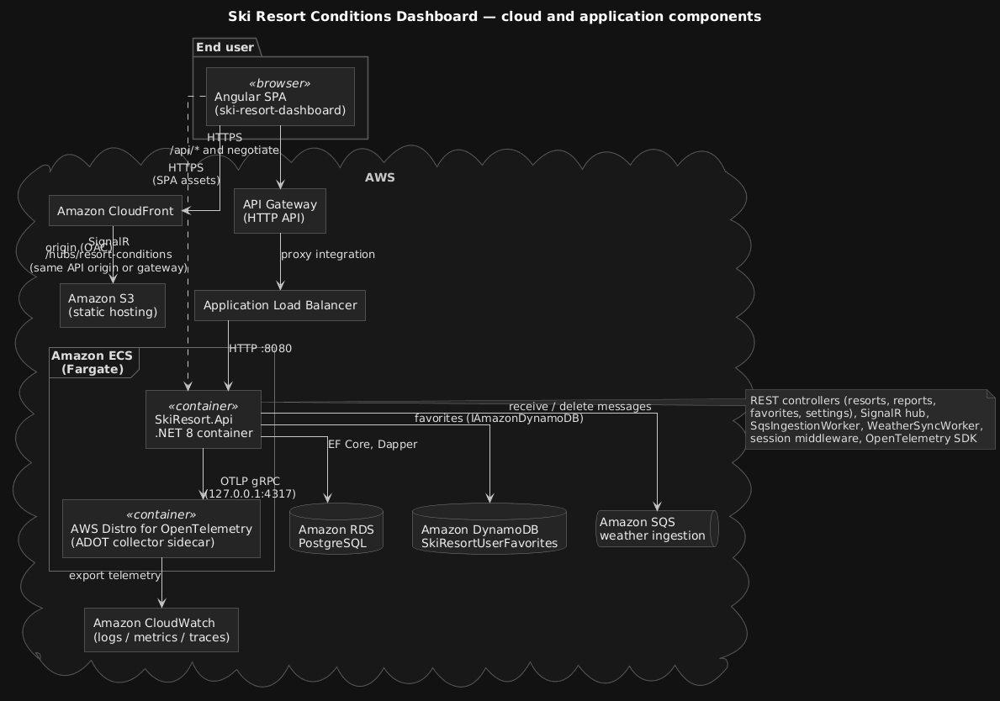
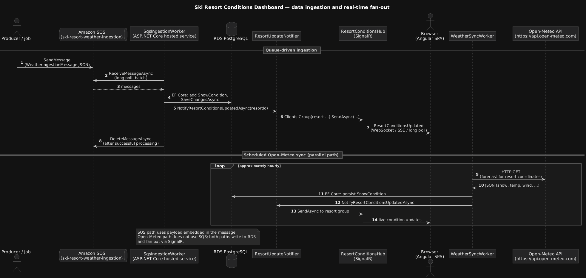

# Ski Resort Conditions Dashboard

A production-style, low-traffic **ski resort conditions** dashboard: live snow and lift/run snapshots, multi-resort comparison, favorites, and session-backed preferences. The stack is **Angular 17** (Material, Leaflet maps, SignalR client) and **ASP.NET Core 8** (REST, SignalR hub, EF Core + Dapper, hosted workers).

**Live app (CloudFront):** [Ski Resort Dashboard — resorts](https://dnjatcqx268s0.cloudfront.net/resorts)

## Screenshots

| Resort list & map | Resort detail |
|:---:|:---:|
|  |  |

| Favorites | Snow comparison | Settings |
|:---:|:---:|:---:|
|  |  |  |

---

## Tech stack

| Layer | Technologies |
|-------|----------------|
| **SPA** | Angular 17, Angular Material, RxJS, Leaflet, `@microsoft/signalr` |
| **API** | ASP.NET Core 8, SignalR, session middleware, `IAsyncEnumerable` streaming |
| **ORM / SQL** | Entity Framework Core 8, Npgsql; **Dapper** for bulk/report queries |
| **Data stores** | PostgreSQL (local Compose / **Amazon RDS**); **DynamoDB** for favorites in AWS |
| **Messaging** | **Amazon SQS** (`SqsIngestionWorker`); scheduled **Open-Meteo** HTTP sync (`WeatherSyncWorker`) |
| **Real-time** | SignalR hub `/hubs/resort-conditions`; optional **Redis** backplane for multi-instance |
| **Observability** | OpenTelemetry (traces, metrics, OTLP); **AWS Distro for OpenTelemetry** → **CloudWatch** in AWS |
| **Contracts** | Pact (.NET consumer + provider tests; pact JSON under `pacts/`) |
| **Cloud (reference deployment)** | S3 + CloudFront (SPA), API Gateway HTTP API, ALB, **ECS Fargate**, ECR — see [`docs/aws-architecture.md`](docs/aws-architecture.md) |

---

## Architecture

Traffic flows from the browser to a static frontend on **S3/CloudFront**, while **API Gateway** fronts the **.NET API** on **ECS Fargate** (behind an **ALB**). The API uses **RDS PostgreSQL** for resort and condition data, **DynamoDB** for favorites, **SQS** for optional queue-driven ingestion, and **SignalR** for push updates. **OpenTelemetry** exports to an **OTel collector** sidecar, which forwards telemetry to **CloudWatch**.

### System overview (flowchart)



### Detailed diagrams

| Diagram | Source `.puml` | What it shows |
|-------------------------|----------------|---------------|
|  | [`docs/component-architecture.puml`](docs/component-architecture.puml) | CloudFront/S3, API Gateway, ALB, ECS, RDS, DynamoDB, SQS, OTel, CloudWatch, SignalR |
|  | [`docs/sequence-data-ingestion.puml`](docs/sequence-data-ingestion.puml) | SQS path and hourly Open-Meteo sync → PostgreSQL → SignalR → browser |

**AWS resource names, networking, and CORS** are documented in [`docs/aws-architecture.md`](docs/aws-architecture.md).

---

## Local development

### Prerequisites

- [.NET 8 SDK](https://dotnet.microsoft.com/download)
- [Node.js](https://nodejs.org/) (LTS) and npm — for the Angular app
- [Docker](https://www.docker.com/) — optional but recommended for PostgreSQL via Compose

### Backend

From the repository root:

```bash
dotnet build
```

Run the API (uses `appsettings.Development.json` for PostgreSQL unless overridden):

```bash
dotnet run --project backend/SkiResort.Api/SkiResort.Api.csproj
```

**Database with Docker Compose** (Postgres + API container):

```bash
docker compose up --build
```

The API is exposed on **http://localhost:5000** (mapped to container port 8080). Ensure migrations/schema match your environment; in Development the app may call `EnsureCreated` and seed data — see `backend/SkiResort.Api/DevSeeder.cs`.

### Frontend

```bash
cd frontend/ski-resort-dashboard
npm install
npm start
```

Configure the SPA to call your API base URL (environment / proxy as set up in the Angular project).

### Configuration and secrets

- **PostgreSQL**: `ConnectionStrings:Postgres` in `backend/SkiResort.Api/appsettings.Development.json`, or override with `ConnectionStrings__Postgres`.
- **AWS (SQS, DynamoDB)**: default region from `AWS:Region` or `us-east-1`; credentials via the standard AWS SDK chain (`AWS_PROFILE`, environment variables, etc.).
- **SQS ingestion**: set `SqsIngestion:QueueUrl` (or env `SqsIngestion__QueueUrl`) to enable `SqsIngestionWorker`; if empty, the worker logs and idles.
- **Favorites**: `Favorites:UseInMemoryRepository` defaults to `true` in Development; set to `false` and configure DynamoDB for AWS-like behavior locally.
- **SignalR scale-out**: optional Redis backplane via `ConnectionStrings:Redis` or `SignalR:RedisConnectionString` for multiple API instances.
- Do **not** commit real secrets. Use environment variables or a secret manager.

### Contract tests (Pact)

- **Consumer-style pact generation** (writes JSON under `pacts/`): `backend/SkiResort.Tests/Contracts/ResortsConsumerPactTests.cs`
- **Provider verification** (reads pact file; requires running API when `PACT_PROVIDER_BASE_URL` is set): `backend/Pact.Provider.Tests/Contracts/ResortsProviderPactTests.cs`

---

## Running in AWS (high level)

1. Build and push the API image from `backend/SkiResort.Api/Dockerfile` to Amazon ECR.
2. Run the container on **Amazon ECS Fargate** behind an **Application Load Balancer**; expose **Amazon API Gateway HTTP API** to the internet with routes such as `ANY /api/{proxy+}`.
3. Provision **Amazon RDS for PostgreSQL**, **DynamoDB** table `SkiResortUserFavorites`, and **SQS** queue `ski-resort-weather-ingestion`; grant the task IAM role SQS and DynamoDB permissions.
4. Host the Angular build on **S3** with **CloudFront**; point the SPA at the API Gateway base URL.
5. Optionally run the **AWS Distro for OpenTelemetry** collector as a sidecar and configure OTLP export to **CloudWatch**.

Step-by-step resource names, networking, and CORS notes are in [`docs/aws-architecture.md`](docs/aws-architecture.md).

---

## Evaluation criteria — evidence mapping

Use this table to trace each criterion to concrete artifacts in the repository.

| # | Criterion (summary) | Where to look in this repo |
|---|---------------------|----------------------------|
| **1** | Cloud API router (e.g. API Gateway) | [`docs/aws-architecture.md`](docs/aws-architecture.md); Mermaid diagram above; [`docs/diagrams/component-architecture.png`](docs/diagrams/component-architecture.png) |
| **2** | API managed in cloud (e.g. ECS Fargate) | [`backend/SkiResort.Api/Dockerfile`](backend/SkiResort.Api/Dockerfile); [`docker-compose.yml`](docker-compose.yml) (`api` service); [`docs/aws-architecture.md`](docs/aws-architecture.md) |
| **3** | Message queuing (SQS) | [`backend/SkiResort.Api/Workers/SqsIngestionWorker.cs`](backend/SkiResort.Api/Workers/SqsIngestionWorker.cs); [`backend/SkiResort.Api/Options/SqsIngestionOptions.cs`](backend/SkiResort.Api/Options/SqsIngestionOptions.cs); [`backend/SkiResort.Api/Program.cs`](backend/SkiResort.Api/Program.cs); [`docs/diagrams/sequence-data-ingestion.png`](docs/diagrams/sequence-data-ingestion.png) |
| **4** | Cloud sync / NoSQL (DynamoDB) | [`backend/SkiResort.Infrastructure/Favorites/UserFavoritesRepository.cs`](backend/SkiResort.Infrastructure/Favorites/UserFavoritesRepository.cs); [`backend/SkiResort.Api/Controllers/FavoritesController.cs`](backend/SkiResort.Api/Controllers/FavoritesController.cs); [`backend/SkiResort.Api/Program.cs`](backend/SkiResort.Api/Program.cs); Angular: `frontend/ski-resort-dashboard/src/app/core/services/favorites.service.ts` |
| **5** | **KEY** — RDS PostgreSQL | [`backend/SkiResort.Infrastructure/Data/SkiResortDbContext.cs`](backend/SkiResort.Infrastructure/Data/SkiResortDbContext.cs); [`backend/SkiResort.Domain/Entities/`](backend/SkiResort.Domain/Entities/); [`backend/SkiResort.Infrastructure/Migrations/`](backend/SkiResort.Infrastructure/Migrations/); [`docker-compose.yml`](docker-compose.yml) (`db` service) |
| **6** | **KEY** — Containers / ECS | [`backend/SkiResort.Api/Dockerfile`](backend/SkiResort.Api/Dockerfile); [`docker-compose.yml`](docker-compose.yml); [`docs/aws-architecture.md`](docs/aws-architecture.md) |
| **7** | Pact contract tests | [`backend/SkiResort.Tests/Contracts/ResortsConsumerPactTests.cs`](backend/SkiResort.Tests/Contracts/ResortsConsumerPactTests.cs); [`backend/Pact.Provider.Tests/Contracts/ResortsProviderPactTests.cs`](backend/Pact.Provider.Tests/Contracts/ResortsProviderPactTests.cs); generated pact under `pacts/` |
| **8** | OpenTelemetry → CloudWatch | [`backend/SkiResort.Api/Program.cs`](backend/SkiResort.Api/Program.cs); [`backend/SkiResort.Api/Observability/ObservabilityConstants.cs`](backend/SkiResort.Api/Observability/ObservabilityConstants.cs); [`docs/aws-architecture.md`](docs/aws-architecture.md) |
| **9** | SignalR real-time | [`backend/SkiResort.Api/Hubs/ResortConditionsHub.cs`](backend/SkiResort.Api/Hubs/ResortConditionsHub.cs); [`backend/SkiResort.Api/Realtime/ResortUpdateNotifier.cs`](backend/SkiResort.Api/Realtime/ResortUpdateNotifier.cs); [`backend/SkiResort.Api/Program.cs`](backend/SkiResort.Api/Program.cs); [`frontend/ski-resort-dashboard/src/app/core/services/signalr-resort-updates.service.ts`](frontend/ski-resort-dashboard/src/app/core/services/signalr-resort-updates.service.ts) |
| **10** | Sessions | [`backend/SkiResort.Api/Program.cs`](backend/SkiResort.Api/Program.cs); [`backend/SkiResort.Api/Controllers/SettingsController.cs`](backend/SkiResort.Api/Controllers/SettingsController.cs); `settings.service.ts` |
| **11** | Large / efficient data access | [`backend/SkiResort.Api/Controllers/ResortsController.cs`](backend/SkiResort.Api/Controllers/ResortsController.cs) (`GET .../conditions`, `GET .../snow-history/stream`); [`backend/SkiResort.Infrastructure/Reports/SnowComparisonReportRepository.cs`](backend/SkiResort.Infrastructure/Reports/SnowComparisonReportRepository.cs); [`backend/SkiResort.Api/Controllers/ReportsController.cs`](backend/SkiResort.Api/Controllers/ReportsController.cs) |
| **12** | UML / PlantUML | [`docs/sequence-data-ingestion.puml`](docs/sequence-data-ingestion.puml); [`docs/component-architecture.puml`](docs/component-architecture.puml); PNG exports in [`docs/diagrams/`](docs/diagrams/) |

---

## Contributing

See [`CONTRIBUTING.md`](CONTRIBUTING.md) for the code review workflow and conventions.
